# FINAL_PJT - MUSE(Make UR Spirit Elegant)

## 1) 팀원 정보 및 업무 분담 내역💑

| 날짜 |                         권도건(팀장)                         |                         박준영(팀원)                         |
| :--: | :----------------------------------------------------------: | :----------------------------------------------------------: |
| 5/20 | - Figma 구현 - 전체 일정 계획 및 조율  - README 작성 |          - ERD 구조 작성 - Skeleton Code 작성           |
| 5/23 |            - Home(Main) 페이지 - README 작성            |     - Index 페이지 - Signup, Login, Paginator 기능      |
| 5/24 | - Main 페이지 이미지 수정  - Signup, Login 디자인 수정 - README 작성 |    - Like 버튼  - Detail 페이지  - Review 기능     |
| 5/25 |                - PPT 작성 - README 작성                 | - Profile, Community 페이지 - Recommend, Search, Follow 기능 - Review 수정, 삭제 기능 |
| 5/26 |    - 전반적인 디자인 수정 및 검토 README 마무리 작성    |                 - 전반적인 기능 수정 및 검토                 |

## 2) 목표 서비스 구현 및 실제 구현 정도🖥

### 1. HOME

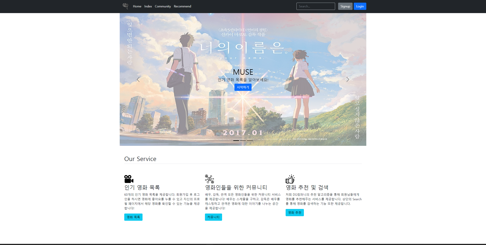

- nav바를 통해 어떤 카테고리로도 넘어갈 수 있도록 구현
  - Signup, Login, Search 버튼도 삽입
- 밑에는 저희가 구현하는 서비스에 대한 설명과 버튼을 구현

### 2. Signup

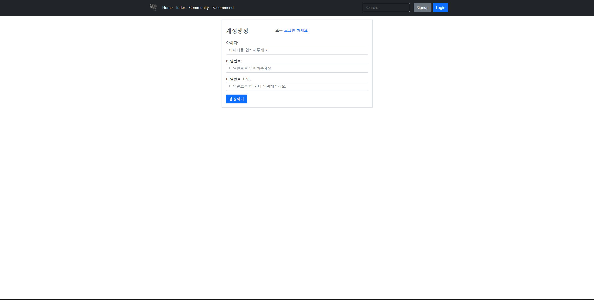

- Signup 버튼을 클릭하였을 때 나타나는 페이지
  - 아이디의 경우 중복되는 데이터가 있는 지 확인
  - 비밀번호의 경우 한 번더 같은 비밀번호를 입력하였는지 확인

### 3. Login

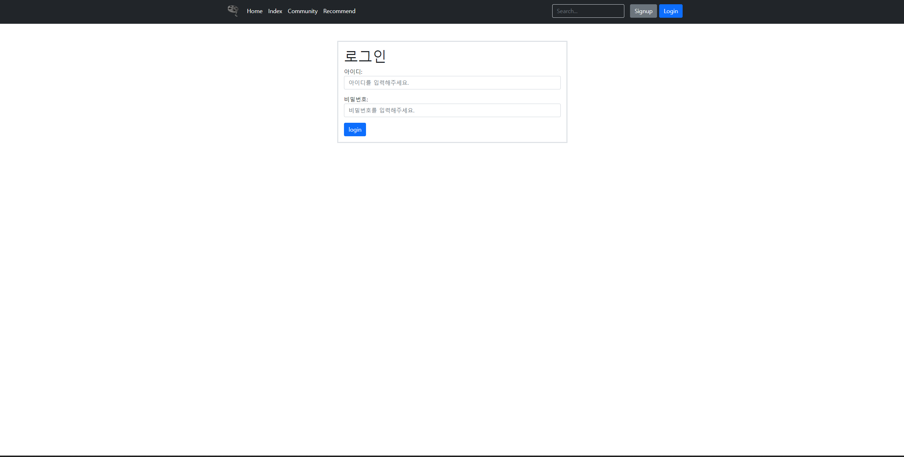

- Login 버튼을 클릭하였을 때 나타나는 페이지
  - 아이디와 비밀번호를 확인

##### 3-1) Profile

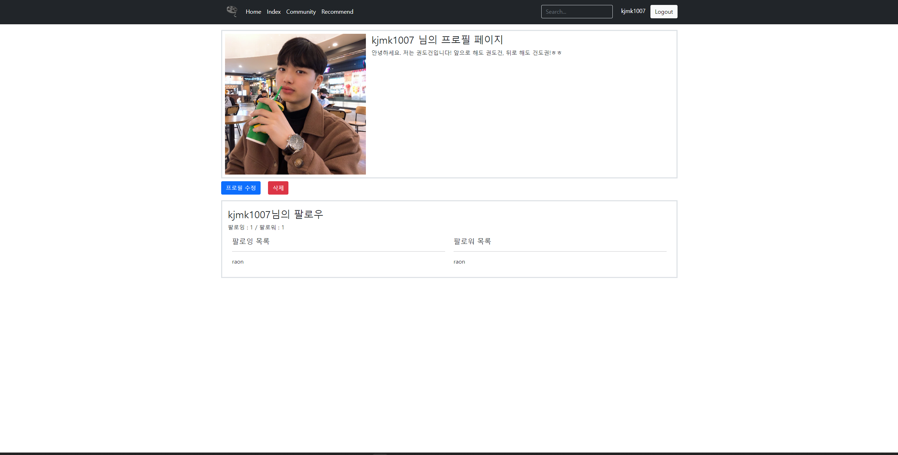

- 로그인 한 후 아이디를 클릭하였을 때 나타나는 프로필 페이지
  - 프로필 사진과 자기소개 글 등록 가능
  - 팔로잉과 팔로워 아이디 확인 가능
  - 수정, 삭제 가능

### 4. Index

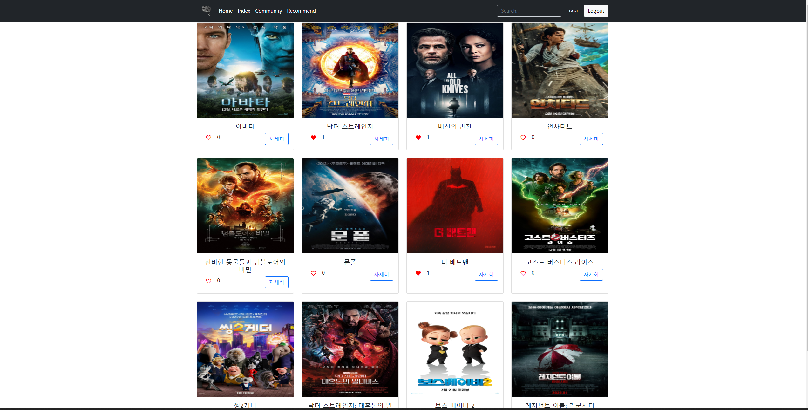

- 영화를 4개씩 나열하여 구현
  - '하트'를 눌러 좋아요를 표현 가능 / 옆에는 좋아요 누른 수를 표현
  - '자세히'버튼을 눌러 영화 디테일 페이지로 이동 가능
- 페이지네이터를 구현

##### 4-1) Detail

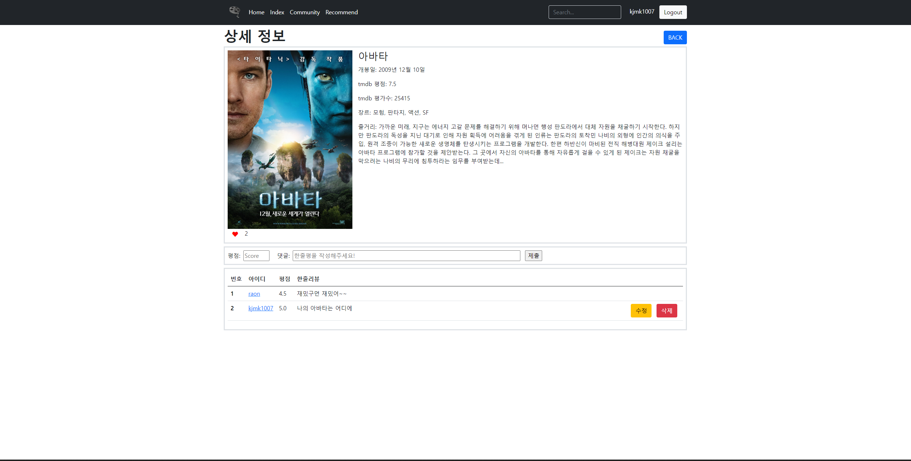

- 영화의 상세정보를 표현
  - 평점, 댓글을 등록할 수 있음
  - 같은 유저가 등록한 댓글의 경우 수정, 삭제가 가능

### 5. Community

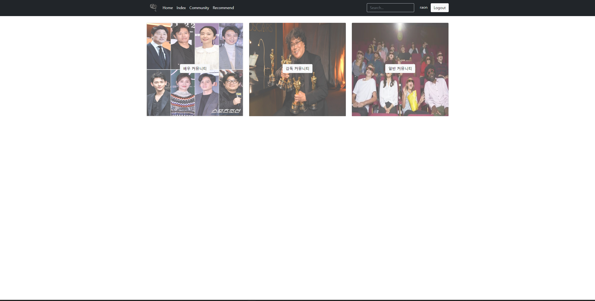

- 커뮤니티 홈에서 배우, 감독, 일반 커뮤니티로 입장 가능

##### 5-1) 배우 커뮤니티

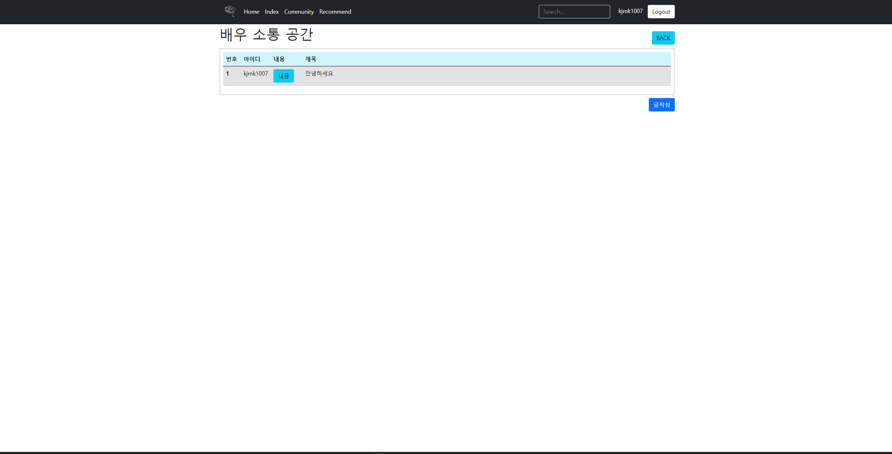

- 배우 커뮤니티에서 양식에 맞는 글을 쓸 수 있음

##### 5-2) 감독 커뮤니티

- 감독 커뮤니티에서 양식에 맞는 글을 쓸 수 있음

##### 5-3) 일반 커뮤니티

- 일반 커뮤니티에서 양식에 맞는 글을 쓸 수 있음

### 6. Recommend

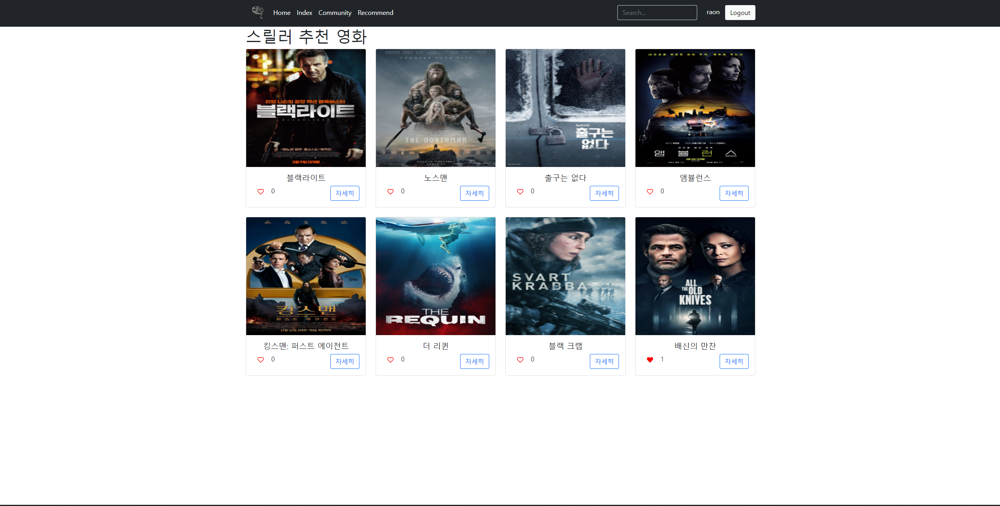

- 추천기능을 통해 해당 유저가 좋아요 누른 장르의 영화를 추천
  - 좋아요 누른 영화가 없다면 랜덤으로 영화 추천

## 3) 데이터베이스 모델링 (ERD)📐

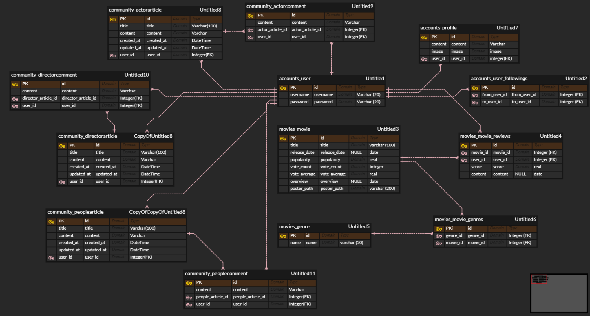

## 4) 필수 기능에 대한 설명✔

##### 4-1) Search

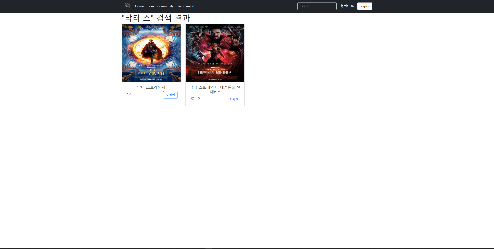

- 1차 적으로 in을 활용 python 과정에서 학습했던 포함 연산자(Containment operator) 'in'을 활용하여 탐색한다. 해당 검색어가 포함된 제목의 데이터가 있으면 담아서 출력한다. 
- LCS (Longest Common Subsequence) 최장 공통 부분수열 in을 활용해 검색된 결과가 없을경우, 알고리즘 스터디에서 학습했던 LCS 알고리즘을 통해 구현해보았습니다.

##### 4-2) Recommend

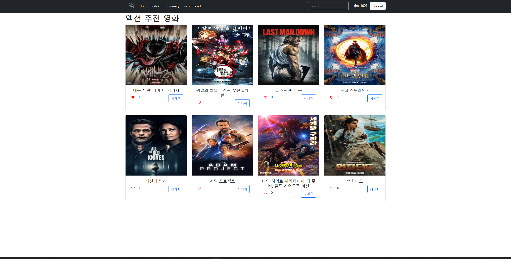

- 로그인 안한 유저이면?
  - python 과정에서 학습했던 random 라이브러리를 활용하여 전체 영화 목록 중 랜덤으로 8개 셈플링해서 보여준다!

- 로그인한 유저이면?
  - 해당 유저가 좋아요 누른 영화가 없다면, 전체 영화 목록 중 랜덤으로 8개 셈플링해서 보여준다!
  - 해당 유저가 좋아요 누른 영화가 있다면, 좋아요 누른 영화의 장르들을 하나씩 뽑아와서 python 과정에서 학습했던 dictionary 자료구조를 통해 카운팅한다.
  - 가장 많이 나온 장르를 찾고 max값이 여러개 이면 그 중 랜덤으로 한 장르를 뽑는다.
  - 그렇게 뽑은 장르를 기준으로 8개의 영화를 랜덤으로 추천해준다. 만약 해당 장르의 영화가 데이터베이스상에 8개보다 적다면 해당 장르의 모든 영화를 추천해준다.

## 5) 기타(느낀 점)❗

> #### 권도건

- 그 동안 배운 기술들을 활용해 하나의 사이트를 처음부터 끝까지 구현해 봤다는 경험만으로 많이 성장한 것 같이 느껴졌습니다.
- 코드를 짜는 것보다 모델 설계와 Figma를 통한 컨셉 구상, 전체 일정 계획 및 조율에서 더 많은 시간을 필요로 하였습니다.
- 이미지나 버튼 위치가 살짝 틀어진 부분에서 크게 시간을 쓰기 보다는 큰 디자인부터 구상하고 점점 좁혀 나가는 방식으로 해야 겠다는 생각이 들었습니다.
- 모달방식으로 구현하는 것이 까다로워 페이지를 넘어가는 방식으로 구현했지만 다음 프로젝트에서는 꼭 모달을 사용할 수 있도록 공부하겠습니다.
- 잘 만든 페이지를 잘 소개하고 다음에 봤을 때도 까먹지 않고 공부할 수 있도록 PPT, README를 잘 작성해야 한다는 생각이 들었습니다.
- 중간 중간 의견충돌도 있고 일정이 맞지 않을 때도 있지만 팀원과 의사소통하면서 맞춰가면서 결과를 완성해가는 과정에서 뿌듯하였습니다.

> #### 박준영

- 일주일간의 협업을 통해 성장할 수 있는 좋은 경험이었습니다.
- 전체일정 계획, ERD 설계, 피그마 디자인 등 모든 과정을 팀장님과 함께 회의하며 구상하여서 좋았습니다. 
- 예상보다 모델 설계와 디자인 등을 구상하는 단계에서 시간이 많이 필요했고, 한 학기 동안 학습한 내용 전체를 복습하며, 처음 뼈대를 잡는 코드를 startproject부터 짜는데 시간이 예상보다 오래걸렸습니다. 
- 일정이 틀어졌을 경우 다시 남은 일정과 남은 기능 구현을 조율해서 다시 계획하고 목표를 향해 팀전체가 함께 달려가는 과정이 즐거웠습니다. 
- Recommend 기능의 경우 python 과정에서 학습했던 자료구조와 연산자, 라이브러리 등을 활용하여 기능을 구현할 수 있어서 좋았습니다. 
- Search 기능의 경우 알고리즘 스터디를 통해 학습했던 LCS 최장 공통 부분수열 알고리즘을 통해 기능을 구현할 수 있어서 좋았습니다. 

