# 관통 PJT

### MUSE

- member
  - 박준영
  - 권도건

- description
  - tmdb api를 활용한 영화 추천 서비스
  - 영화인(배우, 감독, 관객)들의 소통을 위한 커뮤니티

- tools
  - Django
  - Vanilla JS
  - HTML / CSS (Bootstrap 활용)

---

### 일정

- 전체일정
  - 기본개발 (5/20)
    - 메인페이지
    - 영화 목록
    - 영화 세부사항
      - 평점 등록, 수정, 삭제 가능
    - 좋아요 구현
    - 회원가입
    - 로그인 / 로그아웃
    - 팔로우
  - 추천 알고리즘 (5/23)
    - 조건부 랜덤
      - 유저가 좋아요를 한 영화의 장르에 맞춰 추천
      - 좋아요 누른 것이 없다면 랜덤으로 추천
  - 검색 (5/24)
    - `in`으로 구현
    - `LCS`로 구현
  - 커뮤니티 (5/25)
    - 기본구현
      - 모든 유저가 글과 댓글을 등록, 수정, 삭제 가능
      - 작성자의 이름을 클릭하면 프로필 페이지로 이동

---

## 05/20 ~ 23

- 계획
  - 기본개발
    - 메인페이지
      - 네브바(로그인, 회원가입 등)
      - 메인페이지 이미지
      - 참고자료 : https://campaign.naver.com/aihackathon_speech/
    - 영화 목록
      - 카드 형식 (Bootstrap 활용)
      - Grid System (Bootstrap 활용)
      - 영화별 좋아요 버튼 삽입
    - 영화 세부사항
      - 평점 & 리뷰 삽입, 수정, 삭제하는 버튼 (평점은 필수, 리뷰는 선택)
      - 영화별 좋아요 버튼 삽입
    - 프로필
      - 팔로잉 / 팔로워
      - 팔로워 버튼 구현
      - 좋아요 누른 영화목록 (제목으로 표시, 제목을 누르면 세부사항 페이지로 이동)
- 디자인
  - ERD 작성
    - User table, Movie table, Genre table
    - 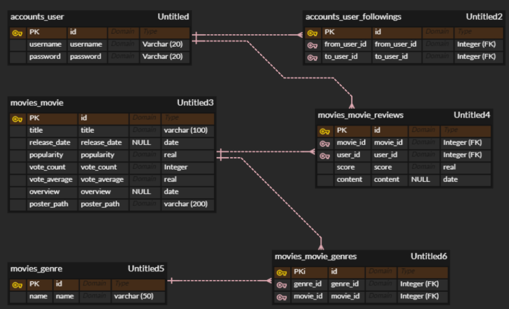
  - Figma 작성
    - https://www.figma.com/file/hSXRPPqkZssuZNqzbXHnuV/Untitled?node-id=0%3A1
    - 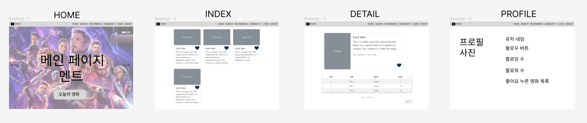

- #### 개발
  
  - README - 권도건
  - skeletone code - 박준영
  - review - 박준영
  - main - 권도건
  - index, paginator - 박준영

- #### 테스트

  - 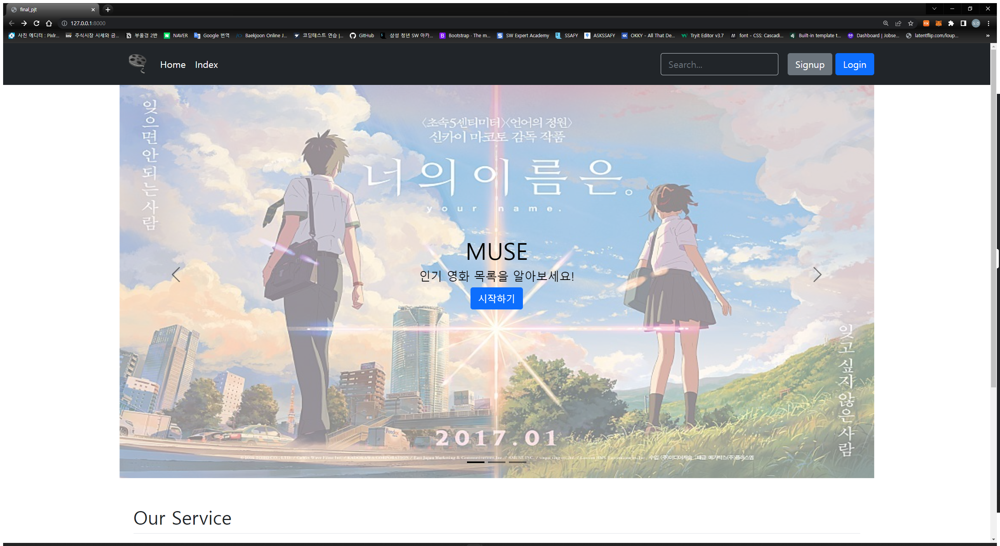
  - 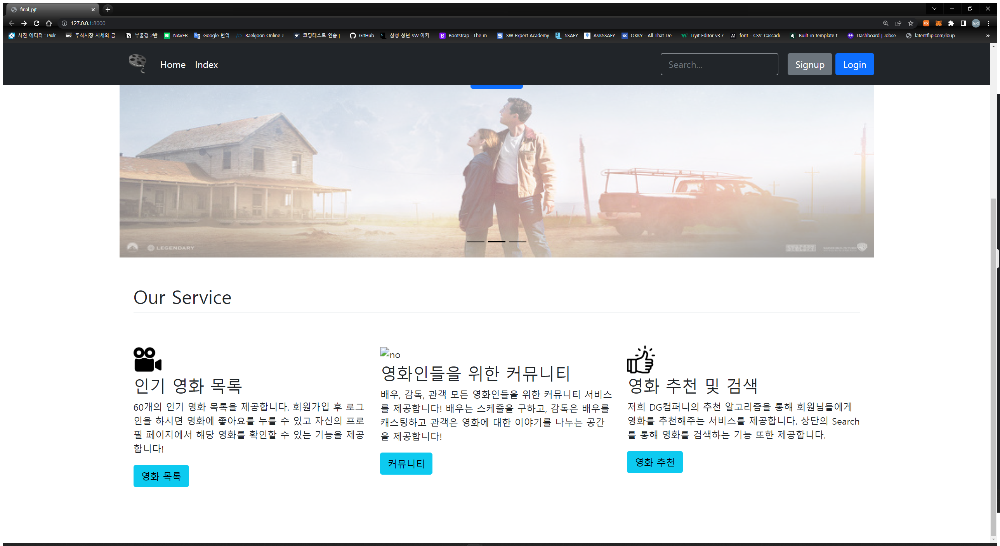

  - 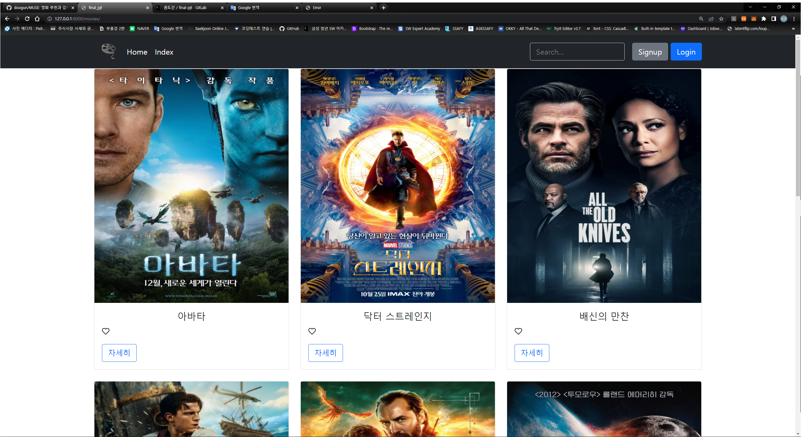

  - 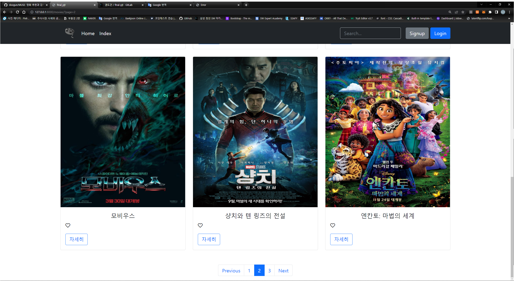

- #### 검토

  - ##### main 개발
    
    - bootstrap과 flaticon을 활용하여 nav바를 구성
    - 홈페이지에서 구현하는 서비스를 명시
    - Home, Index 버튼 활성화

  - 느낀점
    - 이미지를 원하는 크기와 위치에 맞도록 수정하는 부분이 까다로웠다.
    - 어떻게 하면 더 나은 UX와 UI를 구현할 수 있을까 하는 고민이 컸었다.

  

  - ##### index, paginator 개발

    - 영화목록들을 불러와 포스터들을 그리드 카드형식으로 구현
    - 남은 부분들의 스켈레톤 코드 작성

  - 느낀점
    - 각기 다른 크기의 포스터 이미지를 같은 카드형식에 맞도록 수정하는 과정에서 화질을 유지하도록 하는 부분이 까다로웠다.

  

  - 일정 이슈
    - 초반에 설계했던 일정보다 ERD와 모델링 설계해야 하는 부분에서 생각과 구현에서 차이가 많았다.
    - 인덱스 페이지에서 불러오는 데이터가 많아 UX친화적으로 개발하기 위해 시간이 더 소요되었다.

---

## 05/24

- #### 계획

  - 홈에 이미지 변경
  - like 만들기
  - detail, review 만들기
  - signup, login 템플릿 수정
  - static 공부?

- #### 디자인
  
  - 홈 아이콘 이미지는 flaticon 구현
  - like 버튼은 fontawesome 구현
  - 나머지는 bootstrap, css를 통해 구현

- #### 개발

  - ##### 홈 이미지 깨짐부분 수정

  - ##### like 버튼 구현(vanilla JS)

  - ##### detail 페이지 구현

  - ##### search 기능 구현

  - ##### recommend 기능 구현

- #### 테스트

  - 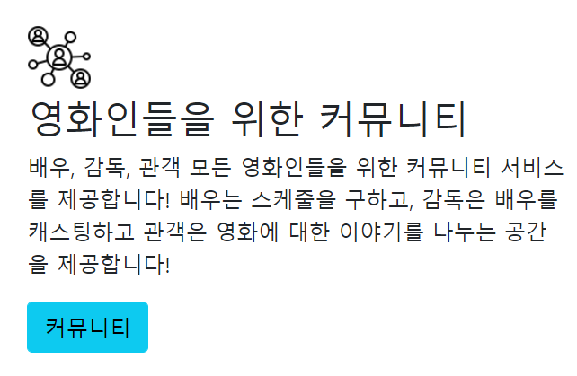

    

  - 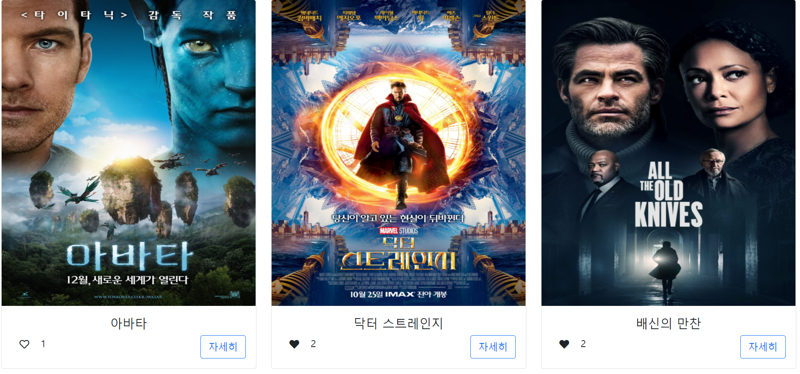

  

  - 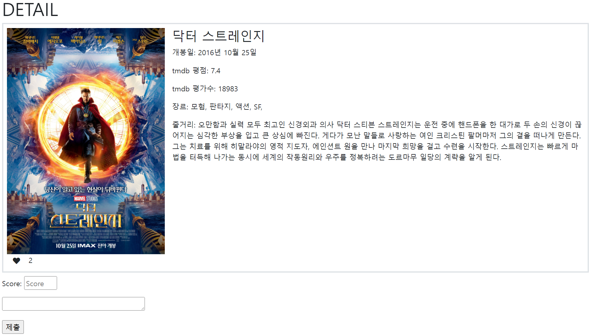
  - 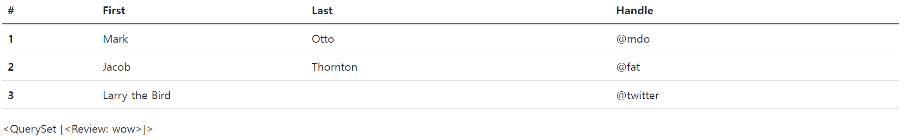
  
  
  
  - 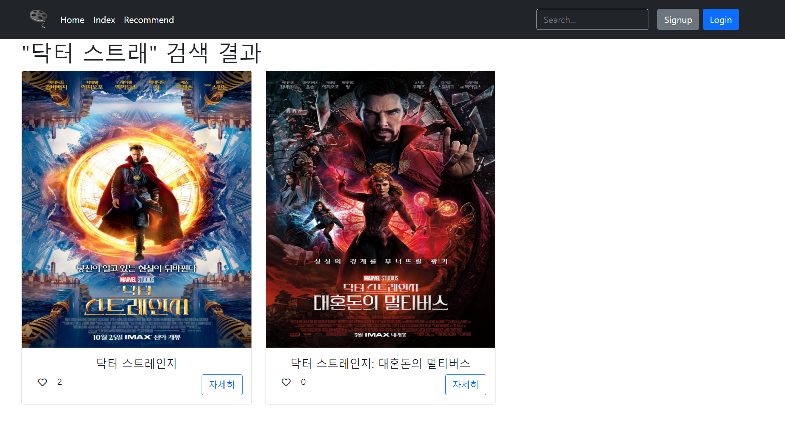
  - 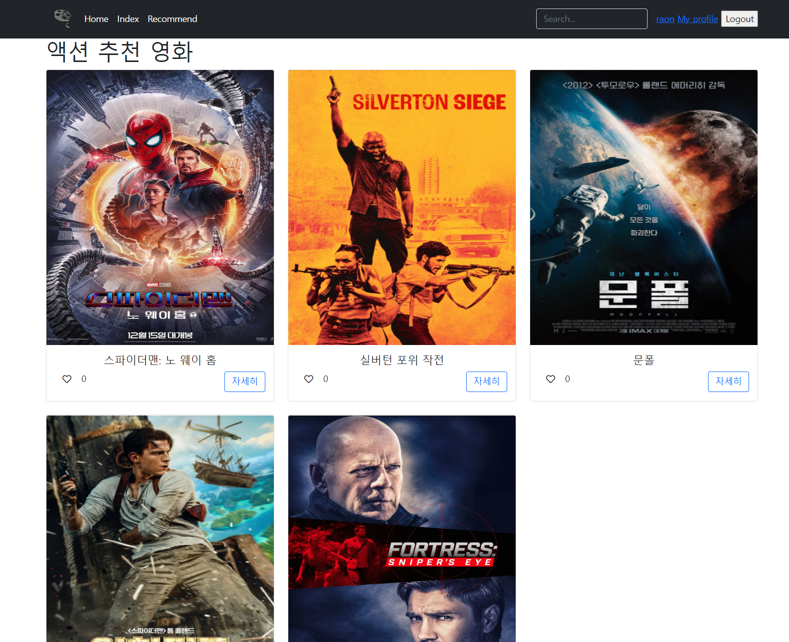

- #### 검토

  -  signup, login 템플릿 수정을 제외하고는 계획에 맞춰 진행됨
  - 추가적으로 recommend와 search 기능을 구현함

---

## 05/25

- #### 계획

  - signup, login 템플릿 수정
  - 댓글 수정, 삭제 구현
  - profile 페이지 구현
  - community 구현
  - 장르 `,` 삭제
  - 팔로우 기능 구현

- #### 디자인

  - signup과 login은 별도의 페이지로 커스텀 폼을 사용
  - 댓글 수정 시 다른 수정 페이지로 이동
  - profile에는 이미지 업로드를 통해 자신만의 사진 등록 가능
  - community에서는 카테고리를 나눠 디자인

- #### 개발

- #### 테스트

- #### 검토

